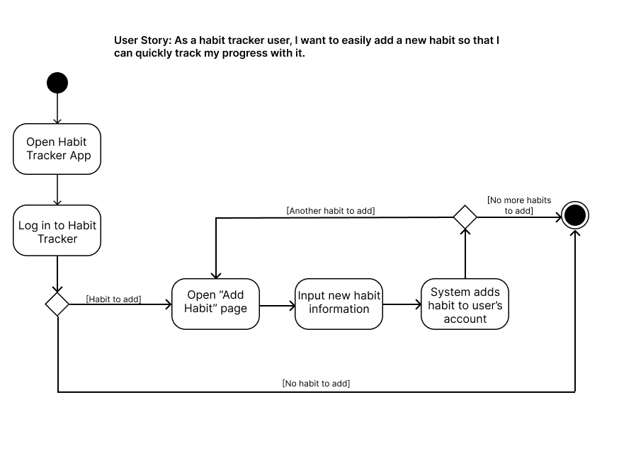
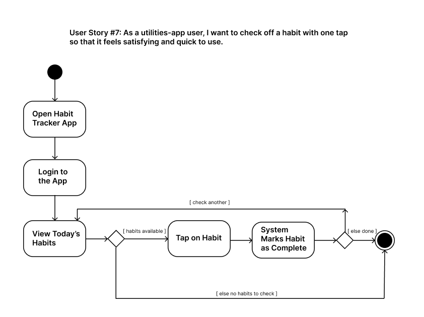

# Specification Phase Exercise

A little exercise to get started with the specification phase of the software development lifecycle. See the [instructions](instructions.md) for more detail.

## Team members

Samuel Yang - https://github.com/SamuelYang24
Howard Appel - https://github.com/hna2019
Sam Murshed - https://github.com/SamMurshed
Aayan Mathur - https://github.com/aayanmathur
Matthew Viola - https://github.com/mlv8821-beep

## Stakeholders

  
<strong> Profile</strong>

- **Name:** Carlos Perdomo  
- **Age:** 21  
- **School:** New York University (NYU)  
- **Year:** 4th Year  
- **Major:** Psychology  
- **Living Situation:** On-campus housing  
- **Workload:**  
  - 6-class course load  
  - Part-time research role  
  - Active job search  
  - Regular gym routine  
- **Personality Traits:**  
  - Ambitious  
  - Disorganized  
  - Easily overwhelmed by overly specific tasks  
- **Tech Usage:**  
  - Heavy mobile user  
  - Apps: Google Calendar, Albert, Apple Notes, Discord  

  
<strong> Problems Identified</strong>

1. Tool fragmentation  
2. Difficulty building habits/discipline  
3. Overly complex productivity tools  
4. Trouble staying on task  

  
<strong> Goals</strong>

1. Track habits and focus on self-improvement  
2. Manage time and tasks efficiently  
3. Establish a consistent daily routine  
4. Use a tool that is easy and intuitive  

## Product Vision Statement

-- **A simple, distraction-free habit tracker** that helps busy students build consistent routines **without overthinking or wasting time.**

## User Requirements

1. As a student with a constantly changing life, I want to easily edit habits so that I can constantly adapt them to my progress 
2. As someone trying to maintain consistent habits, I want to be able to easily delete habits so I can eliminate old and unnecessary distractions
3. As someone who struggles with consistency, I want to see my historical trends so I can identify patterns and plan around them
4. As a visual learner, I want to see my habits represented in calendars so that I can easily track my patterns
5. As someone who has both short and long term goals, I want to be able to set separate timelines for each habit
6. As someone who struggles with consistency, I want to see my historical trends so I can identify patterns and plan around them
7. As someone building multiple habits, I want to categorize habits by time of the day so that I can create structured daily flows
8. As someone motivated by progress, I want to celebrate milestone achievements (like weekly or monthly streaks) with visual rewards or encouraging messages so that I feel recognized for my commitment
9. As someone who forgets to check apps regularly, I want customizable reminder notifications at different times so that I can stay on track
10. As someone who uses accessibility features, I want the app to work well with screen readers and voice commands so that I can track habits regardless of my physical abilities
11. As someone building progressive habits, I want to track increasing goals (minutes read/ steps taken) so that I can build momentum over time
12. As a habit-builder, I want to name my habits whatever I want so that they feel personal and relevant.
13. As someone who values mental wellness, I want space for light reflecting so that I can stay mindful.
14. As a student with a busy schedule, I want to quickly plan habits around my existing commitments so that I don’t feel overloaded.
15. As someone who finds some apps too complex, I want the habit tracker to be intuitive with no learning curve so that I actually keep using it.
16. As a utilities app user, I want to set habits daily or a few times a week so that I can build routines that match my lifestyle.
17. As a Google Calendar user, I want to add a habit to my application in just a few taps so that I don’t waste time setting things up.
18. As a utilities-app user, I want to check off a habit with one tap so that it feels satisfying and quick to use.
19. As a habit tracker user, I want to easily add a new habit so that I can quickly track my progress with it.
20. As a mobile-app user, I want clean visuals with no ads or popups so that I can focus purely on my habits.
21. As a habit tracker user, I want to open the app and immediately see what I need to do today so that I can act quickly.

## Activity Diagrams

## Clickable Prototype

See instructions. Delete this line and place a publicly-accessible link to your clickable prototype here.
